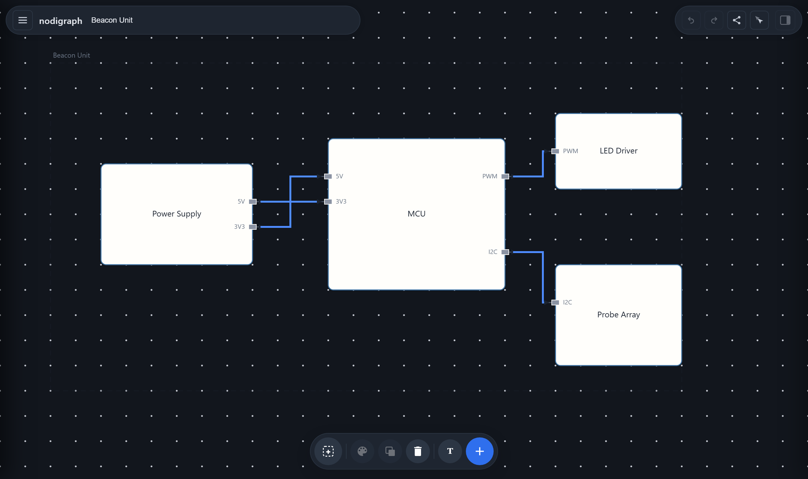

<p align="center">
  
</p>

<h1 align="center">nodigraph</h1>

<p align="center">
  <strong>Block diagrams that live in the URL.</strong><br>
  No account, no database, nothing stored on a server — the link <em>is</em> the file.
</p>

<p align="center">
  <a href="https://nodigraph.com"><strong>Try it → nodigraph.com</strong></a>
</p>

<p align="center">
  
</p>

---

## What it is

A browser editor for **recursive system architecture**. You draw blocks with
named ports, wire them together, and drill into any block to describe how
*it* is built from smaller blocks — all the way down. Every level is itself
a block with its own interface, the top-level product included.

When you share a diagram, the entire thing is compressed into the URL
(`nodigraph.com/?d=…`). Opening that link needs nothing but a browser: no
sign-up, no server round-trip, nothing of yours retained anywhere. Roughly
100 blocks fit comfortably in a link.

It is not an implementation of OMG SysML. The data model is a small custom
schema aimed at being quick to draw and easy to hand to a colleague.

## Why

Architecture diagrams rot because the picture and its source drift apart.
A PNG lands in a document and six months later nobody can find the file
that made it, so the next person redraws it from scratch.

nodigraph's answer is that there is no separate source file to lose. The
picture's link contains the diagram. **Export to Google Docs** makes this
concrete: one Copy button puts the figure and a linked caption on the
clipboard together, so pasting into a Doc drops in both at once and the
figure in your document carries a working link back to the editable
diagram.

## Features

- **Recursive decomposition** — drill into any block to model its internals;
  breadcrumbs to navigate back out, and a button to wrap the whole product
  in a new parent when the scope grows.
- **Ports on a grid** — connectors snap to fixed slots on every edge, so
  wires between blocks line up instead of almost lining up. A new port
  starts undecided — no name, no in/out direction — until you set one in
  the Inspector; it wires up just fine either way, taking on whichever
  direction the other end doesn't already claim.
- **Resize handles** — select a block to see four diamond handles, one
  per edge, sitting outside the block rather than on its border so they
  never fight with a port for the same touch. Click the dashed line of
  the frame you're inside to select and resize it the same way.
- **Orthogonal routing** — wires pave themselves around blocks, with a
  draggable trunk segment when you want a different route. Wires that cross
  without joining bow over each other, so a crossing never reads as a
  connection.
- **Labelled, styled pipes** — double-click a wire to name it, in place,
  the same way double-clicking a block renames it. A selected wire (or
  block) opens in the Inspector too, where its label, colour, and line
  style (solid, dashed, dotted) are all editable fields.
- **Block pictures** — a block's name doubles as an image URL: point it at
  a picture instead of typing a label, and that's what fills the block.
- **Multi-select** — shift-click or shift-drag a marquee to toggle blocks
  in and out of a selection; Ctrl/Cmd-click or -drag always adds, and
  Ctrl/Cmd+Shift always removes. Move the group, or copy/paste it (wires
  between selected blocks come along, and nested sub-architecture is
  copied too).
- **Undo/redo** — toolbar buttons, Ctrl/Cmd+Z, and Ctrl/Cmd+Shift+Z or
  Ctrl+Y to redo, across every edit.
- **Flow animation** — Animate marches the wires as moving dashes, from
  each output toward the input it feeds, to show which way things run.
- **Save into the address bar** — Save (or Ctrl/Cmd+S) writes the diagram
  into this page's own URL, so a bookmark or a reload brings it back. A
  dot on the button marks edits that aren't in the address yet.
- **Share by link** — the whole diagram, gzip-compressed into a URL.
- **Local files** — Download/Upload plain JSON, independent of any server.
- **Live sessions** — invite someone with a link and edit the same diagram
  together, blocks mid-drag included. A public broker only introduces the
  two browsers to each other; the diagram itself travels directly between
  them over WebRTC and never reaches a server.
- **Live multi-client editing** — everyone on the same server instance sees
  changes as they happen.

### Planned

Simulation. The same block-and-port model that describes a system can
execute it — that's the direction this is heading, and the reason the
schema is custom rather than SysML-shaped.

## Run it locally

```bash
git clone https://github.com/nodi-andy/nodigraph
cd nodigraph/server && npm install
node src/app.js
```

Then open `http://localhost:8080`. Project data is read from and written
to `data/project.json` (created on first save). Override the folder with
`NODIGRAPH_DATA_DIR` and the port with `PORT`.

### Deploy

The `Dockerfile` at the repo root builds and serves the whole app, so any
container host works. For Cloud Run:

```bash
gcloud run deploy nodigraph --source . --region <region> --allow-unauthenticated
```

The server listens on `PORT`, which Cloud Run sets automatically. Project
data is written inside the container and does not survive a redeploy —
fine for the shared-link workflow, not yet durable storage.

## How it works

| Concern | Approach |
| --- | --- |
| Rendering | One `<canvas>`, drawn by `client/src/render/` |
| State | A plain block tree (`client/src/model/Project.js`) |
| Sharing | `JSON → gzip → base64url → ?d=` (`model/shareLink.js`) |
| Server | ~150 lines of Node, one dependency (`ws`) |
| Build step | None. The browser loads ES modules directly. |

### Known limits

- **Shared links are snapshots, not sessions.** Editing a link produces a
  new link — press Save to write your edits back into the address bar.
  Two people editing the same link will not see each other's changes:
  send the updated link back, or start a live session.
- **Nothing can add a bookmark for you.** Every browser removed the API
  for it years ago, so Save updates the address and names the shortcut;
  pressing it is yours to do.
- **Live sessions are best-effort.** They use the public PeerJS broker,
  which is rate-limited and offers no uptime guarantee, and a direct WebRTC
  connection without a TURN relay is often blocked by strict corporate
  firewalls. Point `peerSession.js` at your own PeerServer and TURN server
  if you need it to be dependable. Edits are last-write-wins, and the
  session ends when the host closes the tab.
- **The optional local server has no real storage, and nothing in the
  product depends on it.** Running `server/src/app.js` yourself (see "Run
  it locally" above) auto-saves whatever you're looking at to a single
  JSON file with no auth, purely as a convenience for picking up where
  you left off on your own machine — anyone who can reach that server
  could read or overwrite it, so don't expose it beyond your own machine.
  Sharing, collaboration and the hosted app at nodigraph.com don't touch
  it at all: a diagram travels in the link itself or peer-to-peer over
  WebRTC, never through this file.
- Very large diagrams (several hundred blocks) can exceed URL length limits
  imposed by proxies, though not by browsers themselves.
- **A block picture needs a CORS-friendly host.** The browser refuses to
  load it otherwise — safely, falling back to the block's plain-text
  name rather than breaking the diagram's own PNG export. Images hosted
  on this same server work automatically.

## License

AGPL-3.0 (see [LICENSE](LICENSE)) — free to use, modify and self-host. If
you run a modified version as a network service, you must make that
version's source available to its users; this is what keeps the project
itself (and any improvements made to it) open, the same model Mermaid and
similar community-run tools use.

A separate commercial license is available for anyone who wants to run a
modified or embedded version as a closed-source, proprietary service
without that source-sharing obligation — the same dual-licensing model
used by projects like MongoDB and Qt. There's no self-serve process for
this yet; open an issue or otherwise get in touch to ask about one.
