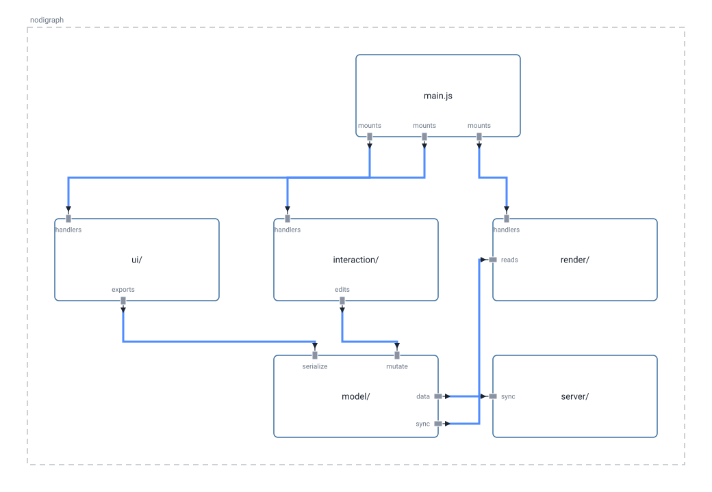

# Architecture

A high-level map of nodigraph's own client, drawn in nodigraph itself and
exported straight from the app (hamburger menu → **Export as SVG**). It's
also the working example for embedding a diagram in a repo: the picture
below is `architecture.svg`, checked in at a stable path next to this file,
with `architecture.nodigraph.json` beside it as the real, editable source.

To update the picture: open `architecture.nodigraph.json` in nodigraph,
edit it, export as SVG again, and overwrite both files at these same paths.
Nothing else in this repo needs to change — anything that links here keeps
working because it was always pointing at a path, not a snapshot.

<!-- nodigraph:architecture.nodigraph.json -->

## The pieces

- **`main.js`** — the entry point. Builds the `Project`, mounts every UI
  panel and dialog, and wires the interaction layer to the render loop.
- **`ui/`** — menus, dialogs, the Inspector panel, selection FABs: every
  visible control outside the canvas itself.
- **`interaction/`** — `DragStateMachine`, hit-testing, and input routing.
  Turns pointer and keyboard events into edits.
- **`render/`** — `SceneRenderer`, `BlockRenderer`, `ConnectionRenderer`.
  Draws the current `Project` to a canvas, or — via `svgContext`, the same
  drawing calls recorded into SVG instead of pixels — to a file like this
  one.
- **`model/`** — `Project`, `Block`, `Connection`, and the grid they snap
  to. The one shared source of truth everything else reads or mutates.
- **`server/`** — a small Node server that persists the project to disk and
  relays live-session updates over WebSocket. Optional: the app works fully
  client-only without it.
