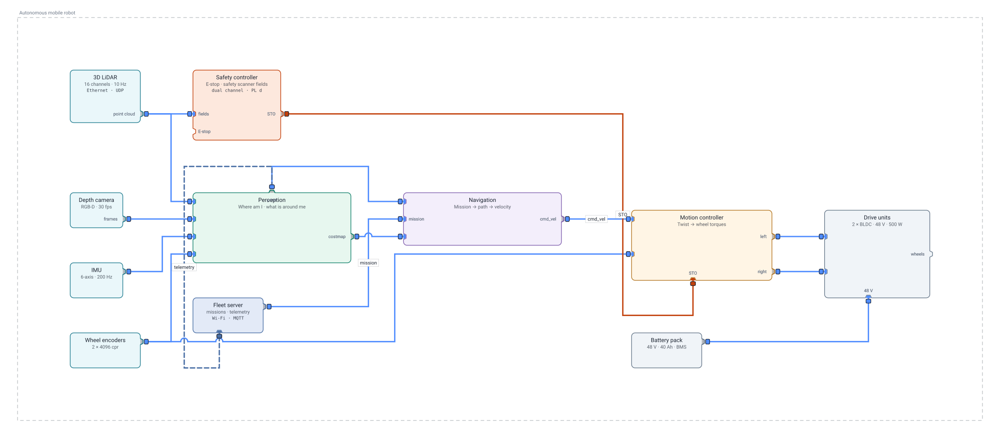
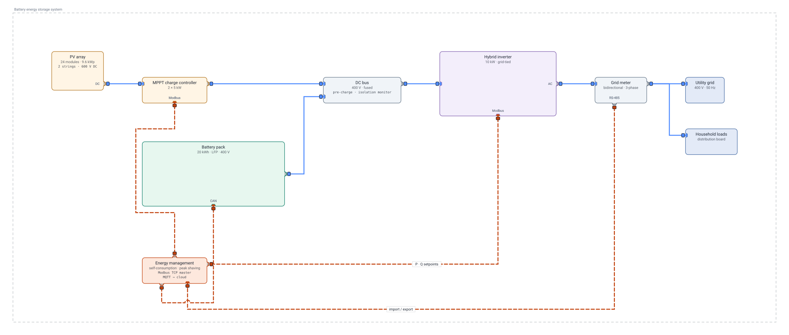
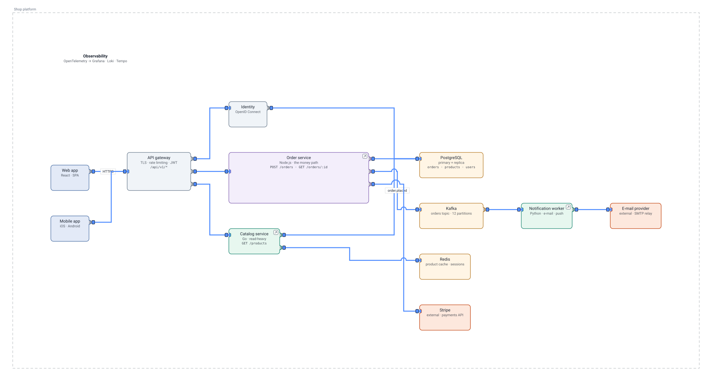
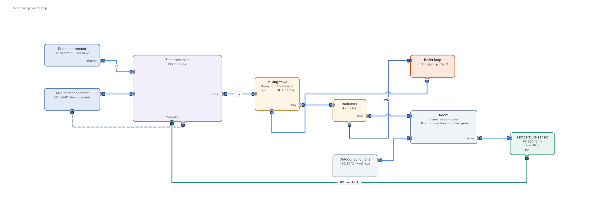
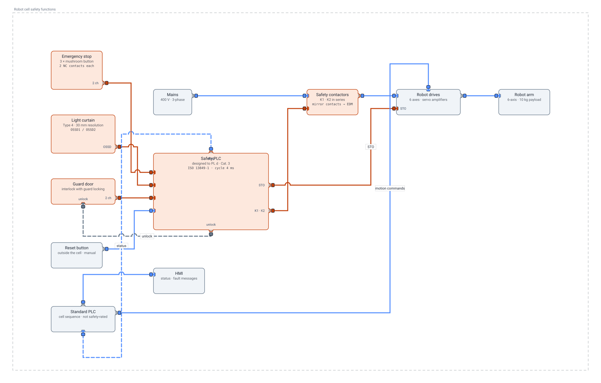
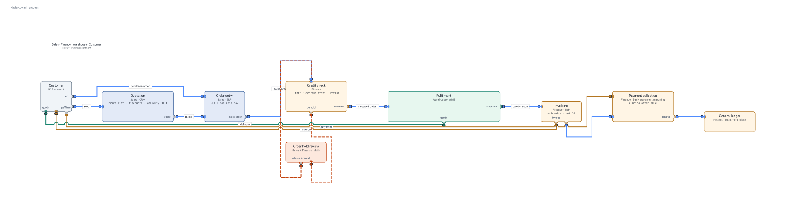

# Examples

Diagrams from different fields, written in the slim YAML format described in
[`../LLM-AUTHORING.md`](../LLM-AUTHORING.md). The six below carry **no
coordinates** — every level is laid out when the file is opened. Click a
picture to open the editable diagram; the pictures are the top level only,
double-click a block in the editor to see inside it.

Regenerate a picture with `node client/tools/svg.mjs docs/examples/<file>.yaml --out docs/examples/<file>.svg`,
and check a file with `node client/tools/lint.mjs docs/examples/<file>.yaml`.

## Autonomous mobile robot — robotics / mechatronics

Sensors → perception → navigation → motion control → drives, three levels
deep; a safety controller's STO path in red, the fleet server's telemetry
dashed. [`mobile-robot.yaml`](mobile-robot.yaml)

## Battery energy storage system — electrical / power

PV array, charge controller, DC bus, a battery pack with its BMS inside, a
hybrid inverter with its power stage and grid controller inside, meter, grid
and loads; an energy management system on a dashed Modbus layer.
[`battery-storage.yaml`](battery-storage.yaml)

## Shop platform — software architecture

Web and mobile clients, an API gateway, services, stores, external APIs and a
worker; the order service drilled into its source files, each a `link` to
where it lives. [`saas-platform.yaml`](saas-platform.yaml)

## Zone heating control loop — process / control engineering

Thermostat, PID controller (drilled into its P, I and D terms), mixing valve,
boiler loop, radiators, room, sensor — and the feedback wire that closes the
loop. [`hvac-control.yaml`](hvac-control.yaml)

## Robot cell safety functions — machine safety

Emergency stops, light curtain and guard door into a safety PLC (drilled into
its dual-channel inputs, logic and test-pulsed outputs), safety contactors and
the drives' STO; the standard PLC and HMI alongside in grey.
[`safety-cell.yaml`](safety-cell.yaml)

## Order-to-cash — a business process

Steps coloured by the department that owns them, the documents between them
as wires, fulfilment drilled into pick, pack and ship, the credit hold as a
dashed loop. [`order-to-cash.yaml`](order-to-cash.yaml)

## Hand-placed examples

- [`local-ai.yaml`](local-ai.yaml) — a local AI assistant, three levels deep,
  every coordinate written by hand; [`local-ai.md`](local-ai.md) walks
  through it level by level.
- [`card-layout.yaml`](card-layout.yaml) — `subtitle`, `lines`, `title_pos`,
  `title_align` and a panel, on a hand-placed level.
