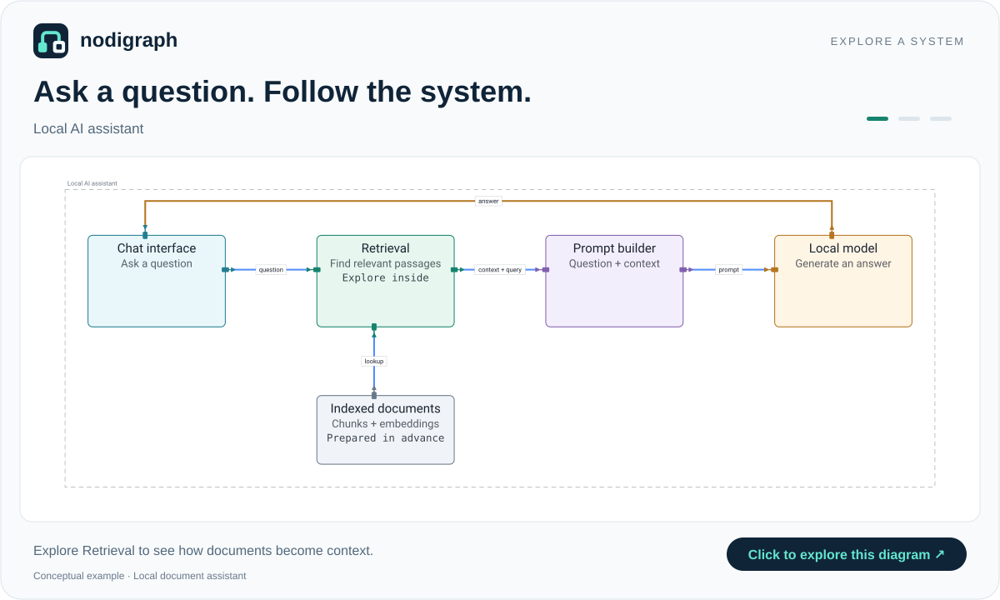
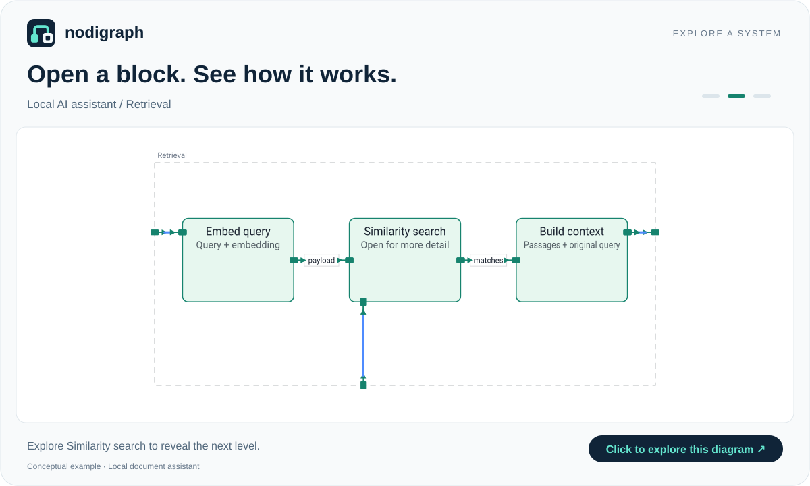
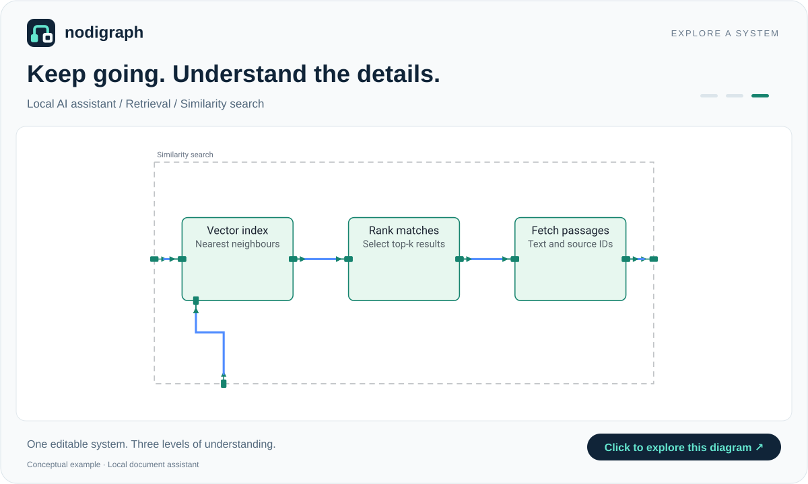

# Explore a local AI assistant

This conceptual example shows how a question about your documents becomes an
answer. It is an educational reference architecture, not a diagram of Ollama
or another specific implementation. Document ingestion and model internals are
outside its scope. The original query travels with the retrieval payload.

[**Open the editable diagram**](https://nodigraph.com/?github=nodi-andy/nodigraph/docs/examples/local-ai.nodigraph.json)

Double-click **Retrieval**, then **Similarity search**, or zoom into those
blocks. Use the breadcrumbs to return to the enclosing system.

## 1. Follow the question

The chat interface sends a question to retrieval. Relevant passages and the
original query become a prompt; the local model generates an answer for the
chat interface. The document index has already been prepared before the query.

## 2. Open Retrieval

The query is embedded, similar passages are found, and the results are
assembled into context. The original query is retained as payload metadata
through these stages. The input at the bottom connects to the prepared index.

## 3. Open Similarity search

The vector index finds candidates; matching results are ranked and their
passage text and source identifiers are fetched. Exact algorithms and storage
choices depend on the implementation.

## Edit and reuse

- [YAML source](local-ai.yaml): open it in nodigraph or paste it onto the canvas.
- [JSON source](local-ai.nodigraph.json): the complete editable project used by the interactive link.
- [Animated preview](local-ai-walkthrough.gif): a looping walkthrough of the three exported levels, not a screen recording.

The README preview is an ordinary linked image. Readers can understand the
overview on GitHub and click through to navigate and edit the diagram.
